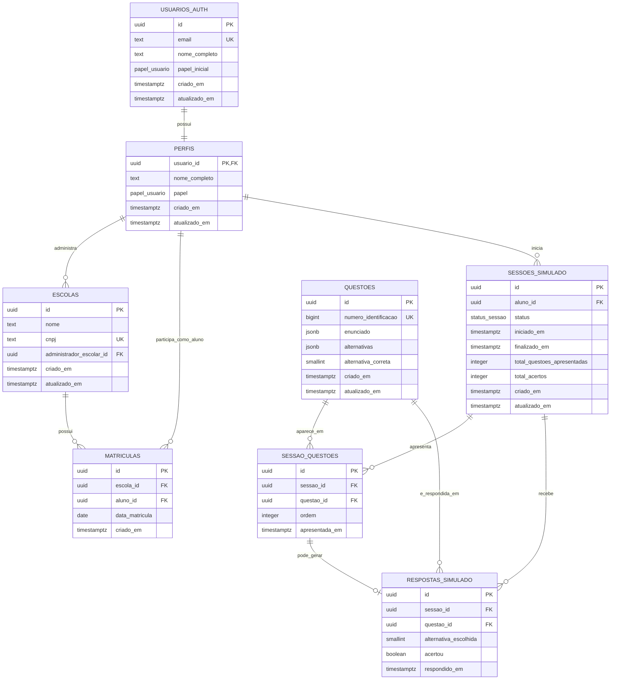

# DER - Simulador ENEM

```mermaid
erDiagram
    USUARIOS_AUTH ||--|| PERFIS : possui
    PERFIS ||--o{ ESCOLAS : administra
    PERFIS ||--o{ MATRICULAS : participa_como_aluno
    ESCOLAS ||--o{ MATRICULAS : possui
    PERFIS ||--o{ SESSOES_SIMULADO : inicia
    QUESTOES ||--o{ SESSAO_QUESTOES : aparece_em
    SESSOES_SIMULADO ||--o{ SESSAO_QUESTOES : apresenta
    SESSAO_QUESTOES ||--o| RESPOSTAS_SIMULADO : pode_gerar
    SESSOES_SIMULADO ||--o{ RESPOSTAS_SIMULADO : recebe
    QUESTOES ||--o{ RESPOSTAS_SIMULADO : e_respondida_em

    USUARIOS_AUTH {
        uuid id PK
        text email UK
        text nome_completo
        papel_usuario papel_inicial
        timestamptz criado_em
        timestamptz atualizado_em
    }

    PERFIS {
        uuid usuario_id PK, FK
        text nome_completo
        papel_usuario papel
        timestamptz criado_em
        timestamptz atualizado_em
    }

    ESCOLAS {
        uuid id PK
        text nome
        text cnpj UK
        uuid administrador_escolar_id FK
        timestamptz criado_em
        timestamptz atualizado_em
    }

    MATRICULAS {
        uuid id PK
        uuid escola_id FK
        uuid aluno_id FK
        date data_matricula
        timestamptz criado_em
    }

    QUESTOES {
        uuid id PK
        bigint numero_identificacao UK
        jsonb enunciado
        jsonb alternativas
        smallint alternativa_correta
        timestamptz criado_em
        timestamptz atualizado_em
    }

    SESSOES_SIMULADO {
        uuid id PK
        uuid aluno_id FK
        status_sessao status
        timestamptz iniciado_em
        timestamptz finalizado_em
        integer total_questoes_apresentadas
        integer total_acertos
        timestamptz criado_em
        timestamptz atualizado_em
    }

    SESSAO_QUESTOES {
        uuid id PK
        uuid sessao_id FK
        uuid questao_id FK
        integer ordem
        timestamptz apresentada_em
    }

    RESPOSTAS_SIMULADO {
        uuid id PK
        uuid sessao_id FK
        uuid questao_id FK
        smallint alternativa_escolhida
        boolean acertou
        timestamptz respondido_em
    }
```
